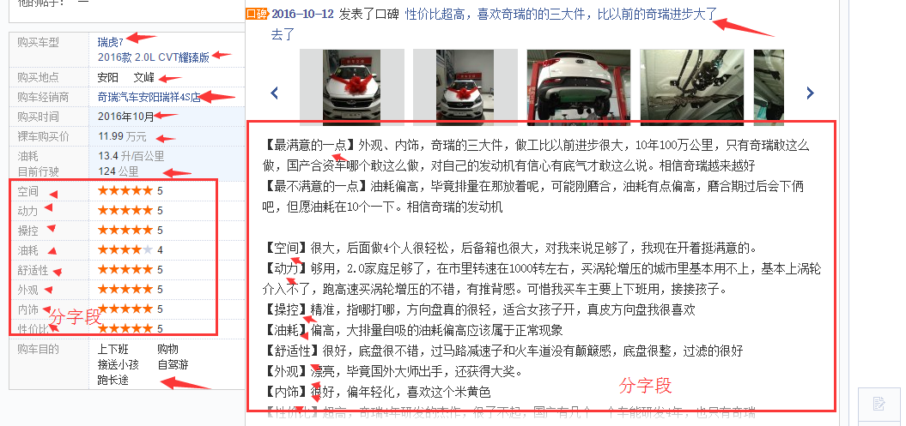
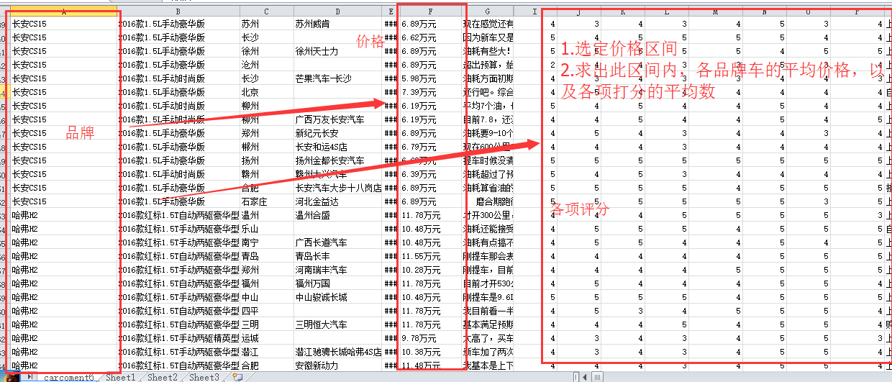
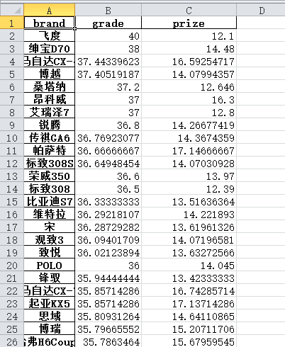
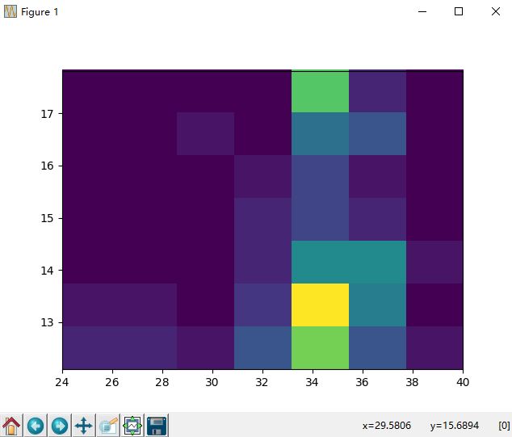

# autocar_evaluate_crawl
<h3>多线程抓取汽车之家网站的所有车型的口碑信息，并制作成excel表，并进行数据分析，辅助买车决策</h3>

<h4>1. 抓取字段如以下</h4>

<h4> 2.运行</h4>

- 开启Mysql ,并创建数据库 create database test3
- 第一步python3 store.config.py 先创建表
- 然后运行 screen python3 carcarwl.py  (由于本人是xshell 连vps  ，所以用screen ，让爬虫在云端工作直到结束.

<h4>3.细节</h4>

- 主要 思想 先抓大后 抓小。 先抓取键值总体区域  再来分离。
- 由于一开始 在本地测，会Print 一些未抓取的Item 来分析
- 搬到云端后 直接将 sys.stdout = open（‘logerr.txt’,'w'）,将未抓取的item 写入文本，另外可根据 文本中是否写入了最后一条
 'ok,done!'判断 爬虫是否工作结束。

<h4>4.数据分析</h4>

- 从我们得到的excel中读取 字段品牌 裸车购买价、各项评分

- 锁定价格区间 ，然后求各汽车品牌 的所对应各项打分和的平均数,以及价格的平均数（飞度果然是神车啊 ）
- 展示一下比较靠前的数据，以及直方图

